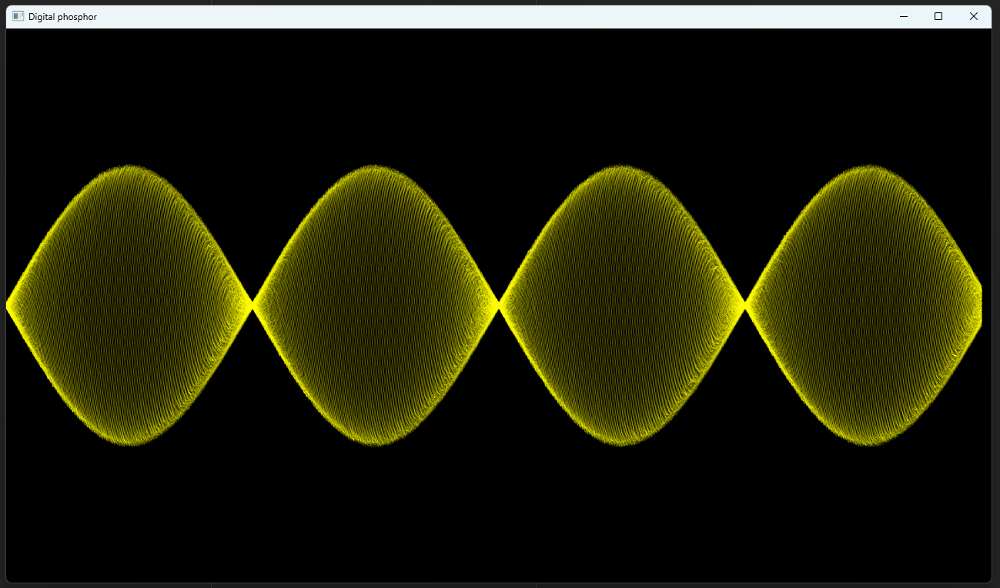
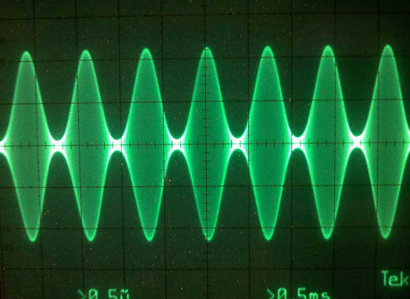

# TestScope

Small experiment in "digital phosphor" rendering in OpenGL

## Background

Fancy oscilloscopes have a "digital phosphor" display system that combines multiple waveform sweeps into a single image with variable intensity that simulates a classic CRT oscilloscope.

This is typically accomplished with an FPGA but I wanted to see if it could be done in GPU shaders for software oscilloscopes like hantek garbage.

## Implementation

The interesting part is how to simulate the speed of the beam which is not constant. Here it's a very simple sum of distances between points. - further research is needed.

Rendering is done with `PrimitiveType.LineStrip` but its slow and poorly supported on modern cards, also the current method of drawing 500 alpha-blended lines on top of each other is not very smart.

## Screenshot

### TestScope

### Real oscilloscope

